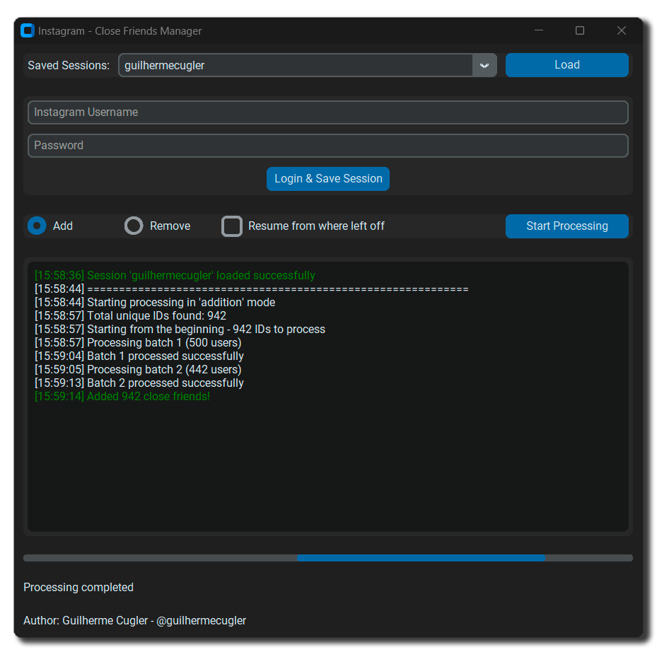

# Instagram Close Friends Manager 🎉


## Description 📖

The **Instagram Close Friends Manager** is a tool that allows you to manage your close friends list on Instagram automatically. With this tool, you can add or remove users from your close friends list efficiently and quickly.

## ⚠️ Disclaimer  

This software is provided "as is", without any warranties of any kind. Using this program may violate Instagram's terms of service and could result in account restrictions or banning.

**The developers are not responsible for any damage, penalties, or loss of access resulting from the use of this software.**

Use at your own risk.





## Features ✨

- **User-Friendly Interface**: Anyone can use it without any programming knowledge.
- **Automatic Login**: Automatically log in to your Instagram account.
- **Close Friends Management**: Add or remove users from your close friends list.
- **Bulk Processing**: Process large amounts of user IDs at once.
- **Progress Bar**: Track the progress of processing in real-time.
- **Resume Processing**: Continue from where you left off in a previous processing session.

## Requirements 📋

- Python 3.8+
- [Playwright](https://playwright.dev/python/docs/intro)
- [CustomTkinter](https://github.com/TomSchimansky/CustomTkinter)
- [httpx](https://www.python-httpx.org/)

## Installation 🛠️


### Using Executable

1. Download the executable for Windows from the [Releases](https://github.com/guilhermecugler/InstagramCloseFriendsManagerPython/releases) page.

2. Run the downloaded executable file.

### Using Python

1. Clone the repository:
    ```bash
    git clone https://github.com/guilhermecugler/InstagramCloseFriendsManagerPython.git
    cd InstagramCloseFriendsManagerPython
    ```

2. Create a virtual environment:
    ```bash
    python -m venv venv
    source venv/bin/activate  # On Windows use `venv\Scripts\activate`
    ```

3. Install the dependencies:
    ```bash
    pip install -r requirements.txt
    ```

4. Install Playwright and its browsers:
    ```bash
    pip install playwright
    playwright install
    ```

## How to Use 🚀

1. Run the main script or executable:
    ```bash
    python InstagramCloseFriendsManager.py
    ```

2. In the graphical interface, log in with your Instagram credentials.

3. Choose the desired operation (Add or Remove) and click "Start Processing".

4. Track the progress in the progress bar and the log console.

## Author 👨‍💻

- **Name**: Guilherme Cugler
- **GitHub**: [guilhermecugler](https://github.com/guilhermecugler)
- **Email**: guilhermecugler@gmail.com
- **Contact**: [+5513997230761](https://wa.me/5513997230761) (WhatsApp)
- **LinkedIn**: [guilhermecugler](https://www.linkedin.com/in/guilhermecugler/)

## License 📄

This project is licensed under the MIT License. See the [LICENSE](LICENSE) file for more details.

## Contributions 🤝

Contributions are welcome! Feel free to open issues and pull requests.

## Acknowledgements 🙏

Thanks to all contributors and users who help improve this project.